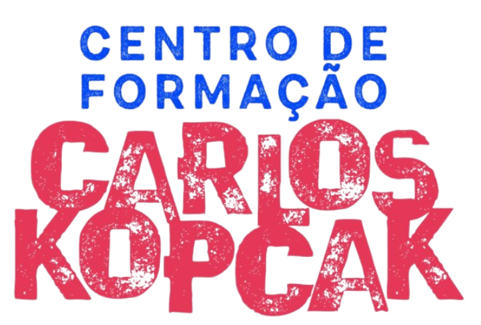
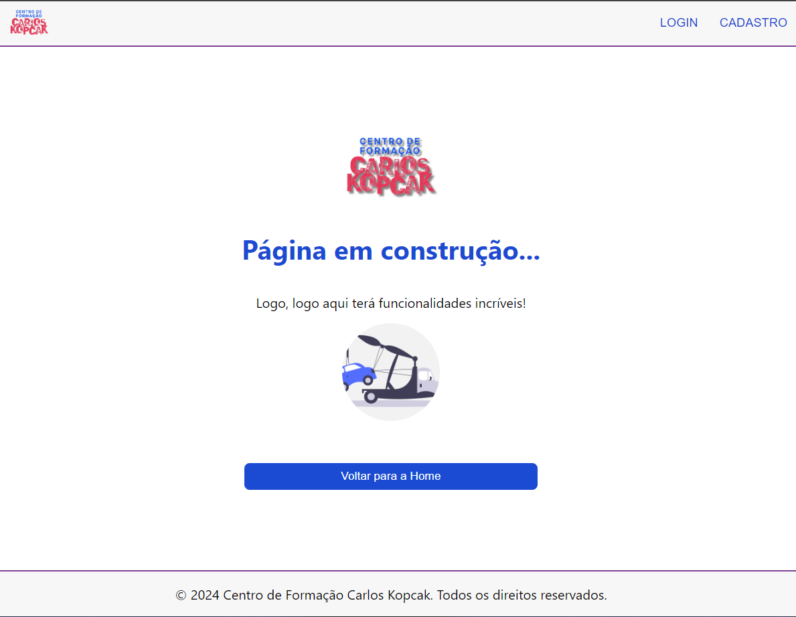
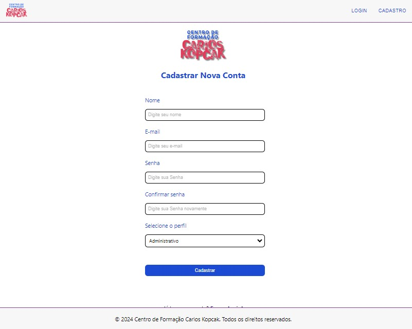
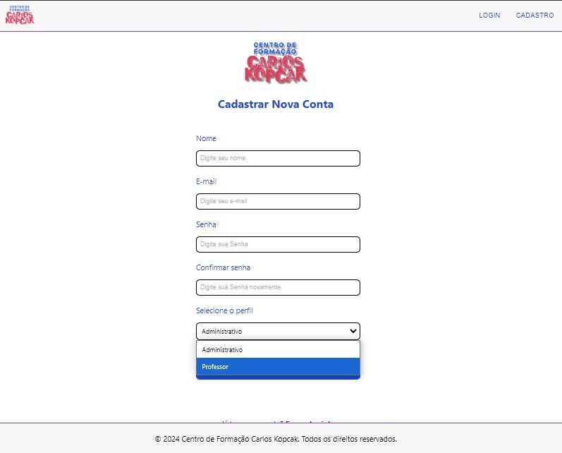

Projeto Integrador para o curso de Tecnologia da Informação da Universidade Virtual do Estado de São Paulo (UNIVESP)

### Organizando dados do Centro de Idiomas do Centro de Formação Carlos Kopcak

 

[Clique aqui para visualizar o site](https://pi-turma006.vercel.app/)

  
***

## Índice
* [1. Prefácio](#1-prefácio)
* [2. Objetivo Geral](#2-objetivo-geral)
* [3- Metodologia](#3-metodologia)
* [4- Detalhamento](#4-detalhamento)
* [5- Instruções para acessar o projeto](#5-instruções-para-acessar-o-projeto)
* [6. Tecnologias Utilizadas](#6-tecnologias-utilizadas)
* [7. Desenvolvedores](#7-desenvolvedores)

## Parte II
### Projeto Integrador em Computação II

* [8. Atualizações](#8-atualizações)
* [9. Lista Desenvolvedores Atualizada](#9-lista-desenvolvedores-atualizada)

***

## 1. Prefácio

Este projeto nasceu da necessidade de organizar e controlar os dados de alunos matriculados em cursos de idiomas gratuitos no Centro de Formação Carlos Kopcak, onde também funciona o Polo UNIVESP de Diadema.

Anteriormente, as informações dos alunos estavam dispersas entre os professores, arquivos digitais e pastas físicas. Este cenário apresentava um desafio significativo em termos de eficiência e acessibilidade. A necessidade era clara: uma solução que permitisse a organização dos dados dos alunos e professores, o registro de presença nos cursos e o armazenamento de materiais didáticos digitais de forma simples, objetiva e clara para os usuários.

Assim, embarcamos em um processo de pesquisa e desenvolvimento para criar um software que atendesse a essas necessidades. Baseando-se em noções de banco de dados e utilizando um framework, iniciamos o desenvolvimento de uma solução que não só resolve o problema apresentado, mas também oferece uma plataforma intuitiva e fácil de usar para todos os envolvidos.

É importante ressaltar que esta solução ainda está em sua fase inicial e será aprimorada ao longo do tempo. Planos futuros incluem a implementação de um banco de dados para melhorar ainda mais a eficiência e a funcionalidade do software.

Este software é o resultado de um esforço coletivo para melhorar a gestão de cursos de idiomas, tornando a educação mais acessível e eficiente. Esperamos que esta solução possa servir como um recurso valioso para o Centro de Formação Carlos Kopcak e para outros que possam enfrentar desafios semelhantes.

***

## 2. Objetivo Geral

Criar uma aplicação para organizar as informações do centro de idiomas de forma sustentável aos funcionários e estudantes, para melhor andamento do trabalho e das aulas.

***

## 3. Metodologia

- Realizamos reuniões pelo *Whatsapp* para definir o fluxo de trabalho;
- Decidimos que a aplicação será no formato *SPA (Single Page Application)* e com isso escolhemos trabalhar com o *React*;
- Todos os formulários possuem verificações e para isso utilizamos o *React-Hook-Form* e o *Yup*;

***

## 4. Detalhamento 

Levando em consideração o nível de conhecimento técnico da equipe que presta serviços para o Centro de Formação, decidimos por utilizar um padrão simples, intuitivo e com cores claras.

Todas as telas são responsivas sendo possível utilizar dispositivos móveis para realizar as funções desejadas.

Para o formulário de matrícula de alunos, decidimos manter o mesmo formato que o impresso que vem sendo utilizado até o momento, com o intuito de minimizar o impacto da transição do papel para o digital.

Todos os *inputs* obrigatórios possuem validações e mensagens de erros descritivos.

Para as funcionalidades que ainda não foram implementadas, criamos uma página informativa, conforme imagem abaixo:

Posteriormente esta página será designada para a funcionalidade de "Página não localizada" (*page not-found*).

### Paleta de Cores

- Decidimos tomar como base as cores da *logo* do centro de formação para usarmos em nossa paleta de cores.

Abaixo, imagem com as cores principais utilizadas:

### Atualizações Futuras

- Implementação do banco de dados;
- Após a implementação do banco de dados somente será possível acessar as telas de "Formulário de Matrícula" e "Lista de Presença" se estiver *logado* no sistema.
- Para a tela de "Lista de presença" a ideia é conter uma tabela dinâmica onde seja possível filtrar os alunos pelo idioma e turma, após o filtro será possível registrar a presença ou ausência do mesmo.

***

## 5. Instruções para acessar o projeto

Este projeto tem como requisito o *deploy*, escolhemos então fazê-lo pelo *Vercel*, portanto o mesmo pode ser visualizado [clicando aqui](https://pi-turma006.vercel.app/)

  

 ***

 ## 6. Tecnologias utilizadas
  

 

  

 ***

  ### 7. Desenvolvedores 

| Aluno                                | RA                   |
| ------------------------------------ | ---------------------|
| Camila Nazaré Pereira Gonçalves      | 23208252             |
| Danielle dos Santos Bonfim           | 2220085              |
| Edcarlos de Sousa Santos             | 2205440              |
| Fernando Caires Borges Gonçalves     | 23203515             |
| Fernando Barbosa Ferraz              | 2222816              |
| Maria Ana Lourenço Rocha             | 2228655              |
| Sandra Maria Felix de Araujo         | 2222006              |
| Thais Stella Teixeira                | 1402571              |

***

## Projeto Integrador em Computação II

  ### 8. Atualizações 

  Para esta segunda parte do Projeto Integrador verificamos a necessidade de criar perfis diferentes no momento do cadastro, para isso realizamos uma alteração na tela de Cadastro.
Anteriormente estava assim:

Com a atualização, para realizar o cadastro é necessário informar qual perfil gostaria de se cadastrar. Deverá realizar a escolha entre o perfil "Administrativo" e o perfil "Professor", para o perfil professor deverá ainda indicar para qual idioma está designado, lembrando que é possível informar mais de um idioma.

Segue abaixo imagens da alteração realizada:

Tela de Cadastro atualizada: 

Tela de cadastro atualizada com as opções de perfis:

Recorte da tela de cadastro com as opções de idiomas para o perfil de professor:

  ### 9. Lista Desenvolvedores Atualizada

| Aluno                                | RA                   |
| ------------------------------------ | ---------------------|
| Camila Nazaré Pereira Gonçalves      | 23208252             |
| Danielle dos Santos Bonfim           | 2220085              |
| Edcarlos de Sousa Santos             | 2205440              |
| Fernando Caires Borges Gonçalves     | 23203515             |
| Fernando Barbosa Ferraz              | 2222816              |
| Mauricio Neves Pereira               | 2008309              |
| Sandra Maria Felix de Araujo         | 2222006              |
| Thais Stella Teixeira                | 1402571              |
